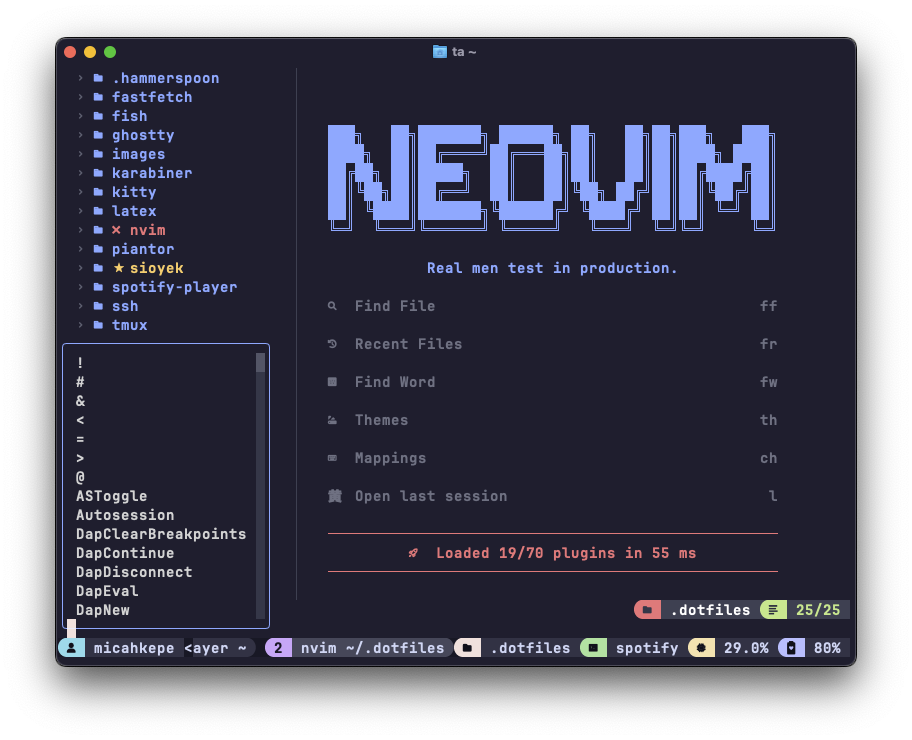

# Micah's Dotfiles



My personal dotfiles for macOS/Linux. This repository contains my configurations
for Neovim/ Vim, Hammerspoon, and more. I have included a bootstrap script that
will create the necessary symlinks for the configurations and install required
packages.

> [!NOTE]
> This repository is a work in progress and is constantly being updated.
> Additionally, if you want to give these dotfiles a try, I recommend forking
> and reviewing the code before giving them a whirl.

<details>
<summary>Fastfetch</summary>

**MacOS**:


**Linux**:


</details>

<details>
<summary>Vimtex/ Sioyek</summary>


</details>

<details>
<summary>Spotify Player</summary>


</details>

## Quick Setup (Recommended)

Run the bootstrap script to setup prerequisites like Homebrew and Xcode
Command Line Tools if needed, clone the repository to `"$HOME"/.dotfiles`,
install Homebrew packages, and create symlinks for all configuration files:

```bash
/bin/bash -c "$(curl -fsSL https://raw.githubusercontent.com/micahkepe/dotfiles/refs/heads/main/bootstrap.sh)"
```

## Manual Setup

<details open>
<summary>For macOS</summary>

1. Install Xcode Command Line Tools:

```bash
xcode-select --install
```

2. Install [Homebrew](https://brew.sh/):

```bash
/bin/bash -c "$(curl -fsSL https://raw.githubusercontent.com/Homebrew/install/HEAD/install.sh)"
```

</details>

---

1. Clone this repository:

```bash
git clone https://github.com/micahkepe/dotfiles ~/.dotfiles
```

2. Run the bootstrap script:

```bash
cd ~/.dotfiles && ./bootstrap.sh
```

## Other Goodies

- [Stylus](https://chromewebstore.google.com/detail/stylus/clngdbkpkpeebahjckkjfobafhncgmne?hl=en)
  - [Catppuccin Gmail](https://userstyles.world/style/16722/catppuccin-gmail)

- MacOS:
  - [AutoRaise](https://github.com/sbmpost/AutoRaise) &rarr; "follows focus
    mouse" behavior for MacOS
  - [System Color Picker](https://apps.apple.com/us/app/system-color-picker/id1545870783?mt=12)
    &rarr; color palette utility

- Linux:
  - [Omarchy](https://omarchy.org/) &rarr; opinionated tiling Arch Linux distro

---

And that's it! If you have any suggestions or questions feel free to open an
issue or contact me.
